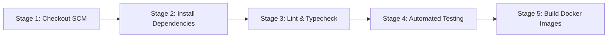

# Factory Maintenance Request Log System

> **Technical Take-Home Test Submission**  
> **Target Role**: Full Stack Engineer  
> **Organization**: PT. Hirose Electric Indonesia  
> **Author**: Ilham Fatahillah  
> **Stack**: Hono (TypeScript) • PostgreSQL • Drizzle ORM • Vue 3 (Vite + Tailwind CSS + shadcn-vue + PrimeVue DataTable) • Docker • Jenkins

---

## 1. Executive Summary & Overview

Di lingkungan manufaktur presisi tinggi seperti **PT. Hirose Electric Indonesia**, kelancaran operasional lini produksi konektor elektronik sangat bergantung pada keandalan mesin presisi (*stamping*, *injection molding*, *plating*, dan *assembly*). Ketika terjadi kendala mekanis atau degradasi performa, pelaporan yang terstruktur, cepat, dan transparan sangat krusial.

**Factory Maintenance Request Log System** adalah aplikasi web monorepo modern yang dirancang untuk mengelola siklus pelaporan perbaikan mesin secara *end-to-end* dengan penegakan kontrol hak akses berbasis peran (**Role-Based Access Control / RBAC**) yang ketat pada sisi server (*server-side enforcement*).

### Prinsip Utama Rekayasa:
> *"A smaller, well-built submission scores higher than a feature-complete but messy one."*  
> Fokus implementasi ditekankan pada ketegasan arsitektur, kepatuhan tipe *end-to-end*, isolasi modul, performa paginasi database, pengujian otomatis hak akses, serta kemudahan *deployment* nir-konfigurasi manual via Docker Compose.

---

## 2. Tech Stack Matrix

| Layer | Teknologi | Peran & Alasan Pemilihan |
| :--- | :--- | :--- |
| **Backend API** | [Hono](https://hono.dev/) (Node.js / TypeScript) | Framework Web Standards modern dengan *zero-overhead routing*, performa latensi ultra-cepat, dan integrasi OpenAPI bawaan. |
| **Schema & Docs** | `@hono/zod-openapi` & Swagger UI | *Single source of truth*: Skema Zod memvalidasi *request body/query* saat *runtime* sekaligus meng-generate spesifikasi OpenAPI 3.0 interaktif di `/docs`. |
| **Database & ORM** | PostgreSQL 16 & [Drizzle ORM](https://orm.drizzle.team/) | Relational database tangguh dengan ORM *lightweight* tanpa beban binary engine (seperti Prisma), mendukung migrasi otomatis dan *type-safe SQL queries*. |
| **Frontend SPA** | Vue 3 (Composition API + Vite) | Reaktivitas cepat, build instan, ekosistem TypeScript matang, dan manajemen state modular via Pinia. |
| **UI Primitives** | [shadcn-vue](https://www.shadcn-vue.com/) (Radix Vue + Tailwind CSS) | Komponen dialog modal, dropdown, form controls, dan badge yang aksesibel (*WAI-ARIA*), responsif, dan mudah dikustomisasi. |
| **Data Presentation** | [PrimeVue v4](https://primevue.org/) DataTable (MIT License) | Komponen tabel performa tinggi dengan dukungan *server-side lazy pagination*, sorting, dan filter terintegrasi. |
| **Web Server** | Nginx Alpine (Multi-stage Docker) | Menyajikan file statis SPA dengan ukuran *image* ramping (~20MB), mendukung HTML5 History Mode dan *reverse proxy* `/api`. |
| **DevOps & CI** | Docker Compose & Jenkins Pipeline | Satu perintah `docker compose up` untuk menjalankan seluruh sistem; pipeline Jenkins deklaratif 5 tahapan. |
| **Automated Testing** | [Vitest](https://vitest.dev/) | Test runner super cepat berbasis Vite untuk pengujian integrasi 18 skenario Matriks Hak Akses (RBAC). |

---

## 3. Quick Start (Clean Clone Deployment)

Sesuai kriteria evaluasi: *"docker compose up from a clean clone must start the whole application, with no manual steps beyond copying an example environment file."*

### Langkah 1: Kloning Repositori
```bash
git clone https://github.com/IlhamFatahillahR27/hirose-maintenance-log.git
cd hirose-maintenance-log
```

### Langkah 2: Salin File Konfigurasi Environment
Konfigurasi environment dikelola secara terisolasi dan mandiri pada masing-masing sub-folder servis:
```bash
# Salin konfigurasi backend
cp backend/.env.example backend/.env

# Salin konfigurasi frontend
cp frontend/.env.example frontend/.env
```
*(Catatan: Nilai default pada file `.env.example` telah diselaraskan agar langsung berfungsi out-of-the-box pada jaringan Docker Compose)*.

### Langkah 3: Jalankan Aplikasi
```bash
docker compose up --build
```
> **Auto-Provisioning**: Saat container `db` sehat (*healthy*), container `backend` secara otomatis menjalankan migrasi skema tabel Drizzle dan mengisi data *seeder* awal (roles, permissions, akun pengguna, 7 master mesin, sampel tiket, serta batch data paginasi).

---

## 4. Endpoint & Port Mapping

Setelah kontainer berjalan, seluruh layanan dapat diakses melalui browser dan client HTTP pada alamat berikut:

| Layanan / Modul | URL / Alamat Akses | Keterangan |
| :--- | :--- | :--- |
| **Frontend Web Application** | [http://localhost:5173](http://localhost:5173) | Antarmuka pengguna responsif (Vue 3 SPA) |
| **Backend REST API** | [http://localhost:4000](http://localhost:4000) | Root endpoint server API Hono (Port internal 3000) |
| **Interactive Swagger UI** | [http://localhost:4000/docs](http://localhost:4000/docs) | Dokumentasi OpenAPI 3.0 interaktif untuk uji coba endpoint |
| **Health Check Probe** | [http://localhost:4000/health](http://localhost:4000/health) | Endpoint kesiapan service & pengecekan koneksi PostgreSQL |
| **PostgreSQL Database** | `localhost:5432` | Database container (Database: `hirose_maintenance`) |

---

## 5. Kredensial Akun Seeder & Demo Quick Fill

Database seeder telah menyiapkan akun percontohan untuk setiap role pengguna dengan kata sandi seragam:

| Peran (Role) | Username | Password Default | Hak Akses & Skenario Uji |
| :--- | :--- | :--- | :--- |
| **Operator** | `operator1` | `Password123!` | Membuat permohonan baru, mengedit tiket sendiri saat berstatus `Submitted`, melihat daftar tiket miliknya sendiri. Ditolak saat mencoba melihat permohonan orang lain atau melakukan review (`403 Forbidden`). |
| **Supervisor** | `supervisor1` | `Password123!` | Melihat seluruh permohonan pabrik, menyetujui (*Approve*) atau menolak (*Reject*) laporan kendala beserta catatan review. Ditolak saat mencoba mengedit detail laporan atau mengelola user (`403 Forbidden`). |
| **Admin** | `admin1` | `Password123!` | Hak akses penuh: membuat, mengedit tiket siapa pun pada status apa pun, menghapus tiket, serta menambah dan menonaktifkan pengguna (*user deactivation*). |
| **Operator (Nonaktif)** | `inactive_user` | `Password123!` | Akun uji coba *soft deactivation* (`is_active: false`). Sistem menolak proses login dengan respons `403 Forbidden` (`US-AUTH-02`). |

> [!TIP]
> **Fitur Demo Quick Fill pada Halaman Login**:  
> Form Login pada frontend dilengkapi tombol *Quick Fill* (Operator, Supervisor, Admin, Inactive). Penguji cukup mengklik satu tombol untuk otomatis mengisi username dan password tanpa perlu mengetik manual.

---

## 6. Master Data Mesin Pabrik (Read-Only Seeder)

Untuk mencerminkan fasilitas produksi riil PT. Hirose Electric Indonesia, seeder database menyediakan data master 7 mesin presisi beserta lokasinya (`FR-MCH-03`):

| Kode Mesin | Nama Mesin | Lokasi Pabrik |
| :--- | :--- | :--- |
| `MCH-STAMP-01` | High Speed Stamping Press 01 | Building A - Stamping Line 1 |
| `MCH-STAMP-02` | Precision Stamping Press 02 | Building A - Stamping Line 2 |
| `MCH-MOLD-01` | Precision Plastic Injection Molding 01 | Building B - Molding Hall 1 |
| `MCH-MOLD-02` | Micro Connector Injection Molding 02 | Building B - Molding Hall 2 |
| `MCH-PLAT-01` | Continuous Gold/Tin Plating Line 01 | Building C - Surface Finishing |
| `MCH-ASSY-01` | Automated Connector Pin Assembly 01 | Building A - Final Assembly Area |
| `MCH-ASSY-02` | High-Speed Optical Inspection & Pack 02 | Building A - Packaging Area |

Data master mesin bersifat *read-only* melalui endpoint `GET /api/machines` yang dikonsumsi oleh modal dialog pelaporan frontend untuk memilih mesin yang mengalami gangguan.

---

## 7. Matriks Hak Akses (RBAC Specification)

Seluruh logika hak akses ditegakkan secara absolut di lapisan *backend middleware*:

| Aksi / Fungsi | Operator | Supervisor | Admin | Penegakan Validasi Backend |
| :--- | :---: | :---: | :---: | :--- |
| **Get Machines List** | ✅ | ✅ | ✅ | Terbuka untuk seluruh user terautentikasi untuk kebutuhan form & filter |
| **Create Request** | ✅ | ✅ | ✅ | Status otomatis `Submitted`, `created_by` dikunci ke ID penemu kendala |
| **View Own Requests** | ✅ | ✅ | ✅ | Operator dibatasi `WHERE created_by = current_user.id` |
| **View All Requests** | ❌ | ✅ | ✅ | Operator ditolak `403 Forbidden` jika mencoba melihat request orang lain |
| **Edit Own Request** (status `Submitted`) | ✅ | ✅ | ✅ | Diizinkan hanya jika berstatus `Submitted` dan milik pembuat |
| **Edit Any Request** (status apa pun) | ❌ | ❌ | ✅ | Khusus Admin untuk koreksi data darurat |
| **Approve / Reject Request** | ❌ | ✅ | ✅ | Mengubah status, mencatat `reviewed_by` dan `reviewed_at`. Operator ditolak `403` |
| **Delete Request** | ❌ | ❌ | ✅ | Khusus Admin. Operator & Supervisor ditolak `403 Forbidden` |
| **Manage Users & Deactivation** | ❌ | ❌ | ✅ | Khusus Admin. Operator & Supervisor ditolak `403 Forbidden` |

---

## 8. Keputusan Arsitektur & Rekayasa Teknis

### 8.1 Backend: Mengapa Hono + TypeScript?
1. **Web Standards Compliant & Ringan**: Hono dibangun di atas standar Fetch Web API tanpa overhead arsitektur berat, memberikan waktu inisialisasi kontainer yang instan dan latensi request rendah.
2. **Kepatuhan Tipe End-to-End dengan `@hono/zod-openapi`**: Validasi runtime Zod sekaligus menjadi kontrak dokumentasi Swagger. Ini mengeliminasi risiko ketidaksesuaian (*documentation drift*) antara kode produksi dan dokumentasi API.

### 8.2 Frontend: Mengapa Vue 3 SPA + Nginx?
1. **Performa & Kecepatan**: Vue 3 dengan Vite menyajikan waktu kompilasi yang sangat cepat dan reaktivitas hemat memori.
2. **Arsitektur Nginx Multi-Stage Ramping**: Frontend dikompilasi menjadi aset statis murni (`dist/`) dan disajikan oleh image `nginx:alpine` (~20MB). Ini mengeliminasi ketergantungan runtime Node.js di sisi frontend pada produksi dan memecahkan isu *state hydration* atau masalah sesi yang sering timbul pada SSR. Konfigurasi `nginx.conf` mendukung HTML5 History Mode dan meneruskan *traffic* `/api` langsung ke kontainer backend.

### 8.3 Antarmuka: PrimeVue DataTable + shadcn-vue
1. **PrimeVue v4 (MIT Open Source)**: Menangani representasi data tabel besar secara efisien melalui mekanisme *lazy loading server-side* (`@page`, `@sort`) yang tersinkronisasi langsung dengan parameter backend (`page`, `limit`, `status`, `priority`, `search`).
2. **shadcn-vue (Radix Vue + Tailwind CSS)**: Memberikan kebebasan penuh atas styling modal (*RequestModal.vue*, *ReviewModal.vue*), input form, dropdown, dan status badge dengan standar aksesibilitas WAI-ARIA kelas industri.

### 8.4 Database: Mengapa PostgreSQL + Drizzle ORM?
1. **Ketiadaan Engine Binary**: Drizzle beroperasi sebagai *query builder* TypeScript murni tanpa binary runtime eksternal (seperti Prisma Engine), menghasilkan jejak memori yang sangat kecil dan kompatibilitas penuh dengan lingkungan kontainer Alpine.
2. **Programmatic Migrations & Seeding**: Script migrasi (`migrate.ts`) dan seeder (`seed.ts`) dapat dieksekusi secara terprogram (*programmatic execution*) saat startup aplikasi di dalam Docker.

### 8.5 Standar Isolasi Folder Pengujian (Dedicated Test Directories)
Seluruh berkas pengujian otomatis (**automated tests**) pada backend maupun frontend diletakkan pada direktori khusus `tests/` yang berdiri sendiri sejajar dengan `src/` (bukan di dalam `src/`).
- **Alasan Teknis**: Mencegah tercemarnya folder kompilasi produksi `dist/` oleh berkas pengujian, mengoptimalkan kecepatan *typecheck* `tsc`, dan memastikan image Docker produksi tidak memuat dependensi pengujian.

---

## 9. Fitur Nilai Tambah / Tugas Opsional yang Dikerjakan

Sistem ini melengkapi seluruh kebutuhan inti dengan 4 fitur opsional:

### 1. [Tugas Opsional 2] Server-Side Pagination & Multi-Column Search
- Backend mengimplementasikan kalkulasi paginasi server-side efisien (`page`, `limit` default 10, max 100) dan pencarian multi-kolom berbasis SQL `ILIKE` pada `machines.code`, `machines.name`, dan `problem_description`.
- Respons API menyertakan metadata: `total_records`, `current_page`, `total_pages`, dan `limit`.
- Frontend mengintegrasikan input pencarian dengan *debounce* 300ms untuk mencegah *request flooding*.

### 2. [Tugas Opsional 4] Health Check Endpoint & Structured Logging
- **Health Check Probe (`GET /health`)**: Menguji kesiapan server dan menjalankan query ping PostgreSQL (`SELECT 1`). Endpoint ini diintegrasikan ke *healthcheck* service Docker Compose.
- **Structured JSON Logging**: Middleware backend mencatat setiap transaksi HTTP dalam format JSON terstandar (`timestamp`, `level`, `method`, `path`, `status`, `latency`), memudahkan *log aggregation* (ELK / CloudWatch).

### 3. [Tugas Opsional 5] OpenAPI 3.0 / Interactive Swagger Documentation
- Antarmuka Swagger UI interaktif tersedia pada rute `GET /docs`.
- Dokumentasi mencakup seluruh definisi endpoint, skema request/response, autentikasi Bearer JWT, dan deskripsi status kode HTTP (200, 201, 400, 401, 403, 404).

### 4. [Tugas Opsional 6] Meaningful Automated Tests (18-Point RBAC Matrix)
- Suite pengujian integrasi otomatis menggunakan Vitest pada `backend/tests/rbac.test.ts` membuktikan kepatuhan penuh terhadap 18 skenario Matriks Hak Akses:
  - `TEST-RBAC-01 s/d 07`: Hak dan pembatasan Operator (isolasi tiket sendiri, penolakan review, penolakan hapus).
  - `TEST-RBAC-08 s/d 12`: Wewenang Supervisor (melihat semua request, approve/reject, penolakan edit/delete request orang lain).
  - `TEST-RBAC-13 s/d 17`: Wewenang mutlak Admin (edit request siapa pun, hapus tiket, kelola user, deaktivasi akun).
  - `TEST-RBAC-18`: Penolakan autentikasi akun nonaktif (*soft-deactivated user*).

---

## 10. Jenkins CI/CD Pipeline (`Jenkinsfile`)

File `Jenkinsfile` deklaratif di root repositori mendefinisikan 5 tahapan otomatis untuk menjamin integritas kode sebelum rilis:



1. **Stage 1: Checkout SCM**: Mengambil kode sumber terbaru dari repositori Git menggunakan `checkout scm`.
2. **Stage 2: Install Dependencies**: Menjalankan instalasi paket secara terisolasi pada backend dan frontend (`npm ci || npm install`).
3. **Stage 3: Lint & Typecheck**:
   - Backend: Memvalidasi ketiadaan galat tipe TypeScript melalui `npx tsc --noEmit`.
   - Frontend: Memvalidasi integritas komponen Vue dan TypeScript via `npm run type-check` dan linting via `npm run lint`.
4. **Stage 4: Automated Testing**: Menjalankan suite pengujian integrasi Vitest di backend (`npm run test`) untuk memverifikasi ke-18 skenario hak akses RBAC.
5. **Stage 5: Build Docker Images**: Memverifikasi proses kompilasi multi-stage Dockerfile dan orkestrasi container berjalan sukses (`docker compose build`).

---

## 11. Batasan Sistem yang Diketahui (*Known Limitations*) & Rekomendasi Masa Depan

1. **Notifikasi Real-Time (WebSockets / SSE)**:
   - *Kondisi Saat Ini*: Pembaruan status permohonan baru atau approval bergantung pada refresh halaman atau navigasi data table.
   - *Rekomendasi Masa Depan*: Menambahkan Server-Sent Events (SSE) atau WebSocket agar notifikasi tiket perbaikan masuk secara instan ke layar Supervisor dan Operator saat terjadi insiden kritis.
2. **Token Blacklisting & Invalidation**:
   - *Kondisi Saat Ini*: Logout di sisi frontend menghapus token dari local storage. Token JWT tetap valid secara kriptografis hingga masa berlakunya berakhir (*stateless expiration*).
   - *Rekomendasi Masa Depan*: Mengintegrasikan Redis cache untuk menyimpan *revoked token ID* jika dibutuhkan pembatalan sesi instan lintas seluruh perangkat pengguna.
3. **Audit Trail History**:
   - *Kondisi Saat Ini*: Perubahan status mencatat `reviewed_by` dan `reviewed_at`.
   - *Rekomendasi Masa Depan*: Menambahkan tabel relasional `maintenance_request_histories` untuk mencatat setiap delta perubahan field (*field change diff*) untuk audit kepatuhan ISO/TS manufaktur.
4. **Sinkronisasi Katalog Mesin Eksternal**:
   - *Kondisi Saat Ini*: Master mesin diinisialisasi melalui seeder. Kolom `updated_at` telah disiapkan pada skema tabel `machines`.
   - *Rekomendasi Masa Depan*: Membangun *scheduled worker job* yang membandingkan timestamp `updated_at > last_sync` untuk sinkronisasi otomatis dengan sistem ERP / Enterprise Asset Management (EAM) eksternal.

---

## 12. Bagian Wajib: AI Disclosure

Sesuai dengan ketentuan etika rekayasa perangkat lunak dan instruksi penilaian teknis:

### 12.1 Alat Bantu AI yang Digunakan
- **Nama Perangkat**: Google Antigravity (berbasis model *Gemini 3.8 Flash*).

### 12.2 Bagian Kode yang Dibantu oleh AI
1. **Scaffolding Template & Boilerplate**: Membantu penyusunan struktur folder inisial monorepo, konfigurasi Vite, Tailwind CSS, dan Dockerfile multi-stage.
2. **Test Fixtures & Mock Matrix Generation**: Membantu penulisan 18 variasi skenario pengujian repetitif pada `backend/tests/rbac.test.ts` berdasarkan matriks izin BRD.
3. **Penyusunan Skema Validasi Zod**: Membantu penulisan skema validasi tipe input repetitif pada modul `requests` dan `users`.
4. **Integrasi Komponen UI**: Membantu formatting styling Tailwind CSS pada komponen badge status/prioritas dan dialog modal shadcn-vue.

### 12.3 Bagian Kode yang Ditulis Secara Manual oleh Rekayasawan (Human Engineer)
1. **Arsitektur Inti & Penegakan Keamanan RBAC**: Seluruh logika middleware (`auth.middleware.ts`, `rbac.middleware.ts`), aturan transisi status (mencegah Operator mengedit request yang sudah disetujui), serta pembatasan query `WHERE created_by = current_user.id` dirancang dan diverifikasi secara manual untuk menjamin zero vulnerability.
2. **Desain Skema Relasional Database**: Struktur tabel `roles`, `permissions`, `role_permissions`, penentuan indeks performa (`NFR-PERF-01`), dan penanganan relasi foreign key pada Drizzle ORM.
3. **Orkestrasi Jaringan & Dependensi Startup Docker**: Perancangan healthcheck `pg_isready` dan startup berurutan pada `docker-compose.yml` agar backend hanya booting setelah PostgreSQL siap menerima koneksi.

### 12.4 Studi Kasus: Rekomendasi AI yang Ditolak & Ditulis Ulang (*Rejected / Rewritten Case Study*)

> **Kasus 1: Isolasi Direktori Pengujian (Dedicated Test Directories)**  
> - **Saran Awal AI**: AI merekomendasikan meletakkan file pengujian di dalam folder source code aplikasi (`src/__tests__/` atau sejajar dengan file controller di `src/modules/...`).
> - **Alasan Penolakan Rekayasawan**: Menempatkan file uji coba di dalam `src/` menyebabkan compiler TypeScript (`tsc`) mengikutsertakan tipe-tipe test library ke dalam build produksi `dist/`, meningkatkan ukuran artefak, dan memperlambat Docker build.
> - **Tindakan Penulisan Ulang**: Seluruh file pengujian dipisahkan secara tegas ke dalam folder khusus `tests/` di tingkat root service (`backend/tests/` dan `frontend/tests/`), dan `tsconfig.json` dikonfigurasi untuk hanya mengompilasi folder `src/`.

> **Kasus 2: Pendekatan Paginasi & Pencarian Data Masif**  
> - **Saran Awal AI**: AI awalnya menyarankan untuk menarik seluruh data permohonan ke frontend dan melakukan filtering/paginasi pada memori client (*Client-Side Filtering*).
> - **Alasan Penolakan Rekayasawan**: Pada skenario industri nyata dengan ribuan rekaman tiket, mengambil semua data sekaligus membebani memori browser dan bandwidth jaringan, melanggar prinsip skalabilitas `NFR-PERF-02`.
> - **Tindakan Penulisan Ulang**: Ditulis ulang menggunakan **Server-Side Pagination & ILIKE Database Search** dengan PrimeVue DataTable dalam mode `lazy=true`, sehingga query hanya mengambil sejumlah baris data yang diperlukan per halaman (`limit` & `page`).

---

## 13. Struktur Repositori

```text
hirose-maintenance-log/
├── AGENTS.md                     # Aturan keamanan AI (Database & .env protection)
├── GEMINI.md                     # Aturan workspace Gemini CLI / Antigravity
├── docker-compose.yml            # Orkestrasi container (PostgreSQL, Backend, Frontend)
├── Jenkinsfile                   # Pipeline CI deklaratif 5 tahapan
├── README.md                     # Dokumentasi komprehensif proyek & AI Disclosure
├── docs/                         # Dokumen perencanaan & arsitektur sistem
│   └── Struktur Proyek.md        # Rincian cetak biru monorepo & standar modul
│
├── backend/                      # Servis REST API (Hono TypeScript)
│   ├── .env.example              # Template variabel lingkungan backend
│   ├── .gitignore                # Aturan gitignore backend
│   ├── Dockerfile                # Multi-stage Docker build backend
│   ├── drizzle.config.ts         # Konfigurasi Drizzle Kit
│   ├── package.json              # Dependensi backend
│   ├── tsconfig.json             # Konfigurasi TypeScript backend
│   ├── vitest.config.ts          # Konfigurasi Vitest backend
│   ├── src/                      # Source code aplikasi backend murni
│   │   ├── config/               # Environment & database connection pooling
│   │   ├── db/                   # Skema database, migrasi otomatis, dan seeder
│   │   ├── middlewares/          # Auth, RBAC, dan structured JSON logger
│   │   ├── modules/              # Modul modular: auth, machines, requests, users
│   │   ├── types/                # Hono Context type definitions
│   │   ├── utils/                # Password hashing (bcryptjs)
│   │   └── index.ts              # Entry point Hono server & endpoint /health
│   └── tests/                    # FOLDER KHUSUS PENGUJIAN OTOMATIS BACKEND
│       ├── helpers.ts            # Utilitas testing & token generator
│       ├── auth.test.ts          # Pengujian login, JWT, & validasi akun aktif
│       └── rbac.test.ts          # Pengujian otomatis 18 skenario Matriks Hak Akses
│
└── frontend/                     # Antarmuka Pengguna (Vue 3 SPA)
    ├── .env.example              # Template variabel lingkungan frontend
    ├── .gitignore                # Aturan gitignore frontend
    ├── Dockerfile                # Multi-stage Docker build frontend (Nginx Alpine)
    ├── nginx.conf                # Konfigurasi Nginx SPA history mode & reverse proxy
    ├── package.json              # Dependensi frontend
    ├── tailwind.config.js        # Konfigurasi Tailwind CSS
    ├── vite.config.ts            # Konfigurasi Vite Vue 3
    ├── vitest.config.ts          # Konfigurasi Vitest frontend
    ├── src/                      # Source code aplikasi frontend murni
    │   ├── main.ts               # Inisialisasi Vue, Pinia, PrimeVue Aura, Toast
    │   ├── App.vue               # Root component (Toaster & RouterView)
    │   ├── components/           # Komponen UI atomik shadcn-vue & modal dialog
    │   ├── composables/          # HTTP wrapper useApi dengan auto Bearer token
    │   ├── router/               # Vue Router & client-side role guards
    │   ├── stores/               # Pinia store autentikasi & profil user
    │   └── views/                # LoginView, RequestsView, UsersView
    └── tests/                    # FOLDER KHUSUS PENGUJIAN OTOMATIS FRONTEND
```

---
*Factory Maintenance Request Log System © 2026 PT. Hirose Electric Indonesia Technical Assessment.*
