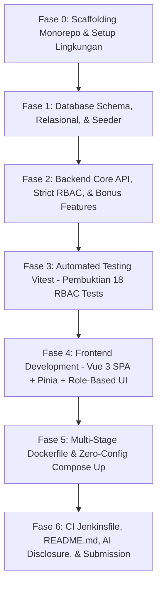

> [!IMPORTANT]
> - **Target Deadline**: 24 September 2026, 10:00 WIB
> - **Prinsip Utama**: *"A smaller, well-built submission scores higher than a feature-complete but messy one."*
> - **Filosofi Integrasi**: Setiap fase pengembangan dikaitkan langsung (*traceable*) ke klausul spesifik pada **[Business Requirements Document (BRD).md](file:///D:/pribadi/Projects/hirose-maintenance-log/docs/Business%20Requirements%20Document%20(BRD).md)** dan skenario pada **[User Stories.md](file:///D:/pribadi/Projects/hirose-maintenance-log/docs/User%20Stories.md)**, serta diakhiri dengan pesan *Git commit* berkala.

---

## 1. Matriks Keterlacakan Antara Roadmap, BRD, dan User Stories

| Fase Pengembangan | Modul Utama | Referensi BRD | Referensi User Stories | Automated Test ID |
| :--- | :--- | :--- | :--- | :--- |
| **Fase 0: Setup** | Scaffolding Monorepo | NFR-OPS-01 | - | - |
| **Fase 1: Database** | Schema, Migrasi, & Seeder | Section 6, 7, FR-MCH-03, NFR-SEC-01 | Persiapan US-AUTH-01, US-MCH-01, US-SYS-01 | - |
| **Fase 2.1: Auth & RBAC** | Autentikasi & Middleware | FR-AUTH-01..06, NFR-SEC-01..04 | US-AUTH-01, US-AUTH-02, US-AUTH-03 | TEST-RBAC-18 |
| **Fase 2.2: Master Mesin** | Read-Only Helper Endpoint | FR-MCH-01, FR-MCH-02 | US-MCH-01 | - |
| **Fase 2.3: Requests API** | CRUD, RBAC, Paginasi | FR-REQ-01..08, FR-REQ-05 (Bonus #2) | US-REQ-01 s/d US-REQ-10, US-SYS-01 | TEST-RBAC-01..14 |
| **Fase 2.4: Users API** | User Management (Admin) | FR-USR-01..04 | US-USR-01, US-USR-02, US-USR-03 | TEST-RBAC-15..17 |
| **Fase 2.5: Observability**| Healthcheck & OpenAPI Docs | FR-OPS-01..03 (Bonus #4 & #5) | US-SYS-02, US-SYS-03 | - |
| **Fase 3: Testing** | Automated Tests Vitest | NFR-TEST-01 (Bonus #6) | Section 7 Vitest Matrix | TEST-RBAC-01 s/d 18 |
| **Fase 4: Frontend** | Vue 3 SPA + Pinia + Router | Seluruh FR & UI Role Matrix | Seluruh Skenario Antarmuka | - |
| **Fase 5: Docker** | Multi-Stage & Compose Up | NFR-OPS-01, NFR-OPS-02 | US-SYS-02 | - |
| **Fase 6: CI & Final** | Jenkinsfile & Deliverables | NFR-OPS-03, Section 8 | - | - |

---

## 2. Rincian Eksekusi Per Fase



---

### Fase 0: Inisialisasi Monorepo & Setup Fondasi (Target: 1 Jam)
* **Korelasi Dokumen**:
  - BRD: `NFR-OPS-01` (Kemudahan instalasi dari nol).
  - Struktur: Mengacu pada dokumen [Struktur Proyek.md](file:///D:/pribadi/Projects/hirose-maintenance-log/docs/Struktur%20Proyek.md).
* **Aktivitas & Checklist**:
  - [x] Inisialisasi Git lokal: `git init`. ✅ 2026-09-23
  - [x] Inisialisasi Backend (Hono TypeScript): ✅ 2026-09-23
    ```bash
    npm create hono@latest backend -- --template nodejs
    cd backend && npm install
    ```
  - [x] Inisialisasi Frontend (Vue 3 Vite SPA): ✅ 2026-09-23
    ```bash
    npm create vue@latest frontend -- --typescript --router --pinia --eslint --prettier
    cd frontend && npm install
    ```
  - [x] Penyiapan dokumentasi root repositori: ✅ 2026-09-23
    - Pembuatan folder `docs/` dan sinkronisasi berkas perencanaan (`BRD.md`, `User Stories.md`, `Struktur Proyek.md`, `Roadmap Project.md`).
    - *(Catatan: `.gitignore` sudah otomatis disediakan oleh scaffolding di masing-masing sub-folder `backend/` dan `frontend/`)*.
* **Kriteria Keberhasilan (Exit Criteria)**:
  - Backend `npm run dev` berjalan menampilkan pesan default Hono.
  - Frontend `npm run dev` berjalan menampilkan halaman starter Vue 3.
* **Git Commit**: `chore: initial monorepo scaffolding for backend (hono) and frontend (vue 3 vite)`

---

### Fase 1: Database Engineering, Skema Relasional RBAC, & Seeder Otomatis (Target: 1.5 Jam)
* **Korelasi Dokumen**:
  - BRD: Model Data Konseptual (Section 6), Data Seeder Awal (Section 7), `FR-MCH-03`, `NFR-SEC-01`, `NFR-PERF-01`.
  - User Stories: Fondasi data untuk `US-AUTH-01`, `US-AUTH-02`, `US-MCH-01`, `US-REQ-01`, dan `US-SYS-01`.
* **Aktivitas & Checklist**:
  - [x] Pembuatan template konfigurasi environment: ✅ 2026-09-23
    - `.env.example` pada root repositori (variabel `PORT`, `DB_HOST`, `DB_PORT`, `DB_NAME`, `DB_USER`, `DB_PASSWORD`, `DATABASE_URL`, `JWT_SECRET`).
    - Salin ke `.env` lokal untuk pengembangan (menghubungkan ke PostgreSQL lokal aktif).
  - [x] Setup aturan eksekusi database aman (`GEMINI.md` / `AGENTS.md`): AI tidak mengeksekusi perintah database otomatis tanpa konfirmasi user. ✅ 2026-09-23
  - [x] Install library database di backend: `npm install drizzle-orm pg dotenv bcryptjs` dan `npm install -D drizzle-kit @types/pg @types/bcryptjs`. ✅ 2026-09-23
  - [x] Buat file skema database (`backend/src/db/schema.ts`): ✅ 2026-09-23
    - **Tabel `roles`**: `id` (Serial PK), `name` (UNIQUE: `'Operator'`, `'Supervisor'`, `'Admin'`), `description`, timestamps.
    - **Tabel `permissions`**: `id` (Serial PK), `name` (UNIQUE: misal `'requests:create'`, `'requests:review'`, dsb.), `description`, timestamps.
    - **Tabel `role_permissions`**: `role_id` (FK -> `roles.id`), `permission_id` (FK -> `permissions.id`), PK composite `(role_id, permission_id)`.
    - **Enum**: `priority_enum ('Low', 'Medium', 'High', 'Critical')`, `status_enum ('Submitted', 'Approved', 'Rejected')`.
    - **Tabel `users`**: `id` (Serial PK), `username` (UNIQUE), `email` (UNIQUE), `password_hash`, `role_id` (FK -> `roles.id`), `is_active` (Default: `true`), timestamps.
    - **Tabel `machines`**: `id` (Serial PK), `code` (UNIQUE), `name`, `location`, `is_active` (Default: `true`), timestamps (disiapkan kolom `updated_at` untuk masa depan sync eksternal).
    - **Tabel `maintenance_requests`**: `id` (Serial PK), `machine_id` (FK -> `machines.id`), `problem_description` (TEXT), `priority`, `status` (Default: `'Submitted'`), `created_by` (FK -> `users.id`), `created_at`, `reviewed_by` (FK -> `users.id`, NULLABLE), `reviewed_at` (NULLABLE), `reviewer_notes` (NULLABLE), `updated_at`.
    - **Indexing Performa (`NFR-PERF-01`)**: Pasang index pada kolom `created_by`, `status`, `priority`, `machine_id`, dan `created_at`.
  - [x] Buat utilitas kriptografi hashing password (`backend/src/utils/password.ts`) menggunakan `bcryptjs` (`NFR-SEC-01`). ✅ 2026-09-23
  - [x] Buat script seeder otomatis (`backend/src/db/seed.ts`): ✅ 2026-09-23
    - **Master Roles & Permissions**:
      - 3 Roles (`Operator`, `Supervisor`, `Admin`).
      - 9 Granular Permissions (`machines:read`, `requests:create`, `requests:read_own`, `requests:read_all`, `requests:update_own`, `requests:update_any`, `requests:review`, `requests:delete`, `users:manage`).
      - Pemetaan `role_permissions` sesuai hak wewenang masing-masing role.
    - **Akun Pengguna 3 Role + 1 Akun Nonaktif**:
      - `operator1` / `Password123!` (Role: Operator)
      - `supervisor1` / `Password123!` (Role: Supervisor)
      - `admin1` / `Password123!` (Role: Admin)
      - `inactive_user` / `Password123!` (`is_active: false`, untuk memverifikasi `US-AUTH-02`)
    - **Master 7 Mesin Presisi Hirose** lengkap dengan detail lokasi gedung (`FR-MCH-03`).
    - **Record Sampel Request**: Minimal 10 sampel tiket bervariasi status + batch dummy data (>1.000 baris) untuk pembuktian uji paginasi & pencarian server-side (`US-SYS-01`).
  - [x] Pasang auto-migration script (`backend/src/db/migrate.ts`) agar mudah dieksekusi oleh user. ✅ 2026-09-23
* **Kriteria Keberhasilan (Exit Criteria)**:
  - Script `npm run db:generate`, `npm run db:migrate`, dan `npm run db:seed` berhasil dieksekusi dan mengisi seluruh tabel di PostgreSQL tanpa error.
* **Git Commit**: `feat(db): relational rbac schema, auto-migrations, and comprehensive seed data`

---

### Fase 2: Backend API Core, Autentikasi, & Penegakan Server-Side RBAC (Target: 5 Jam)

#### 2.1 Modul Autentikasi & Middleware Keamanan
* **Korelasi Dokumen**:
  - BRD: `FR-AUTH-01` s/d `06`, `NFR-SEC-01` s/d `04`.
  - User Stories: `US-AUTH-01`, `US-AUTH-02`, `US-AUTH-03`, `US-SYS-02`.
* **Aktivitas & Checklist**:
  - [x] Install library JWT & Zod OpenAPI: `npm install @hono/zod-openapi zod jsonwebtoken` dan `npm install -D @types/jsonwebtoken vitest`. ✅ 2026-09-23
  - [x] Buat file konfigurasi testing backend (`backend/vitest.config.ts`) yang menargetkan folder khusus `backend/tests/`. ✅ 2026-09-23
  - [x] Buat `logger.middleware.ts`: Structured JSON logging mencatat `timestamp`, `level`, `method`, `path`, `status`, `latency` (**Bonus #4 / US-SYS-02**). ✅ 2026-09-23
  - [x] Buat `auth.middleware.ts`: Ekstraksi Bearer token JWT, verifikasi signature, ambil user dari database, tolak jika `is_active = false` (`401`/`403`), simpan `user` di `c.set('user', user)`. ✅ 2026-09-23
  - [x] Buat `rbac.middleware.ts`: Guard role-based access (`requireRoles(['Admin'])`, `requireRoles(['Supervisor', 'Admin'])`). ✅ 2026-09-23
  - [x] Endpoint `POST /api/auth/login`: Validasi body dengan Zod, cek user & hash password, tolak jika akun nonaktif (`US-AUTH-02`), kembalikan JWT token + info profil ringkas. ✅ 2026-09-23
  - [x] Endpoint `POST /api/auth/logout`: Membersihkan / invalidate sesi token. ✅ 2026-09-23
  - [x] Endpoint `GET /api/auth/me`: Mengembalikan data user yang sedang login beserta role-nya. ✅ 2026-09-23
  - [x] Buat test suite verifikasi di folder khusus `backend/tests/` (`backend/tests/helpers.ts` dan `backend/tests/auth.test.ts`) untuk membuktikan alur login (valid, invalid, deactivated) dan middleware keamanan (15 tests PASSED). ✅ 2026-09-23

#### 2.2 Modul Master Mesin (Read-Only Helper)
* **Korelasi Dokumen**:
  - BRD: `FR-MCH-01`, `FR-MCH-02`.
  - User Stories: `US-MCH-01`.
* **Aktivitas & Checklist**:
  - [ ] Endpoint `GET /api/machines`: Mengembalikan daftar mesin aktif (`id`, `code`, `name`, `location`). Terbuka untuk seluruh role yang terautentikasi untuk kebutuhan opsi dropdown form request di frontend.

#### 2.3 Modul Maintenance Request (CRUD, RBAC, Paginasi & Search)
* **Korelasi Dokumen**:
  - BRD: `FR-REQ-01` s/d `08`, `FR-REQ-05` (**Bonus #2**), Matriks RBAC Section 3.2.
  - User Stories: `US-REQ-01` s/d `US-REQ-10`, `US-SYS-01`.
* **Aktivitas & Checklist**:
  - [ ] `POST /api/requests` (`US-REQ-01`):
    - Input: `machine_id`, `problem_description`, `priority`.
    - Server-side validation (Zod).
    - Status awal otomatis terkunci ke `'Submitted'`.
    - `created_by` otomatis terisi ID user yang login.
    - Mengembalikan `201 Created`.
  - [ ] `GET /api/requests` (`US-REQ-02`, `US-REQ-05`, `US-SYS-01`):
    - **Enforcement Hak Akses**:
      - Jika user adalah `Operator`: Query otomatis dibatasi `WHERE created_by = current_user.id` (`US-REQ-02`).
      - Jika user adalah `Supervisor` / `Admin`: Query membaca seluruh request sistem (`US-REQ-05`).
    - **Filter, Paginasi, & Pencarian Server-Side (**Bonus #2**)**:
      - Parameter query: `page` (default 1), `limit` (default 10, max 100), `status`, `priority`, `search`.
      - Query pencarian menggunakan `ILIKE` pada `machines.code`, `machines.name`, dan `problem_description`.
      - Mengembalikan metadata paginasi: `{ data: [...], pagination: { total_records, current_page, total_pages, limit } }`.
  - [ ] `GET /api/requests/:id`:
    - Mengambil detail satu request beserta relasi nama mesin, lokasi, nama pembuat, dan nama peninjau.
    - Jika user adalah Operator dan request bukan miliknya -> Tolak `403 Forbidden` (`US-REQ-04`).
  - [ ] `PUT /api/requests/:id` (`US-REQ-03`, `US-REQ-04`, `US-REQ-09`):
    - **Aturan Transisi Status & RBAC**:
      - Operator: Hanya boleh mengedit jika request miliknya DAN status masih `'Submitted'`. Jika status sudah `'Approved'`/`'Rejected'`, tolak `403 Forbidden`.
      - Admin: Boleh mengedit request siapa pun dan pada status apa pun (`US-REQ-09`).
      - Supervisor: Ditolak `403 Forbidden` jika mencoba mengedit request orang lain.
  - [ ] `PATCH /api/requests/:id/review` (`US-REQ-06`, `US-REQ-07`, `US-REQ-08`):
    - Wewenang: Khusus `Supervisor` dan `Admin`. Jika Operator mencoba memanggil -> Tolak `403 Forbidden`.
    - Input: `status ('Approved' | 'Rejected')`, `reviewer_notes` (opsional).
    - Sistem otomatis mencatat `reviewed_by = current_user.id` dan `reviewed_at = NOW()`.
  - [ ] `DELETE /api/requests/:id` (`US-REQ-10`):
    - Wewenang: Khusus `Admin`. Jika Operator atau Supervisor memanggil -> Tolak `403 Forbidden`.

#### 2.4 Modul Manajemen Pengguna (Admin Only)
* **Korelasi Dokumen**:
  - BRD: `FR-USR-01` s/d `04`.
  - User Stories: `US-USR-01`, `US-USR-02`, `US-USR-03`.
* **Aktivitas & Checklist**:
  - [ ] Pasang middleware `requireRoles(['Admin'])` pada seluruh rute `/api/users/*`.
  - [ ] `GET /api/users`: Mengembalikan daftar seluruh pengguna tanpa mengekspos hash password.
  - [ ] `POST /api/users`: Menambahkan user baru (username, email, password hash, role).
  - [ ] `PATCH /api/users/:id/status`: Mengaktifkan / menonaktifkan pengguna (`is_active: boolean`).

#### 2.5 Observabilitas & Dokumentasi API Interaktif
* **Korelasi Dokumen**:
  - BRD: `FR-OPS-01`, `FR-OPS-03`.
  - User Stories: `US-SYS-02`, `US-SYS-03` (**Bonus #4 & #5**).
* **Aktivitas & Checklist**:
  - [ ] `GET /health`: Cek kesiapan sistem dan koneksi database PostgreSQL (`SELECT 1`).
  - [ ] Integrasi `@hono/swagger-ui` pada rute `GET /docs` untuk menyajikan antarmuka OpenAPI interaktif.
* **Kriteria Keberhasilan (Exit Criteria)**:
  - Seluruh endpoint API dapat dipanggil dan diuji via Swagger UI di `http://localhost:3000/docs`.
* **Git Commit**: `feat(api): complete rest api with strict server-side rbac, openapi docs, and healthcheck`

---

### Fase 3: Automated Testing RBAC (Vitest) - Pembuktian Hak Akses (Target: 1.5 Jam)
* **Korelasi Dokumen**:
  - BRD: `NFR-TEST-01` (**Bonus #6**), Matriks Hak Akses Section 3.2.
  - User Stories: Matriks Pengujian Otomatis Section 7 (`TEST-RBAC-01` s/d `TEST-RBAC-18`).
* **Aktivitas & Checklist**:
  - [ ] Pasang dependencies testing: `cd backend && npm install -D vitest supertest @types/supertest`.
  - [ ] Konfigurasi `vitest.config.ts`.
  - [ ] Buat file test helper (`backend/tests/helpers.ts`): Utilitas login dan generate token autentikasi per role.
  - [ ] Buat test suite integrasi (`backend/tests/rbac.test.ts`) menguji ke-18 skenario:
    - [x] **TEST-RBAC-01**: Operator create request -> `201 Created` (status default `Submitted`).
    - [x] **TEST-RBAC-02**: Operator view requests -> `200 OK` (hanya tiket miliknya).
    - [x] **TEST-RBAC-03**: Operator view request orang lain -> `403 Forbidden`.
    - [x] **TEST-RBAC-04**: Operator edit tiket sendiri saat `Submitted` -> `200 OK`.
    - [x] **TEST-RBAC-05**: Operator edit tiket sendiri saat SUDAH `Approved` -> `403 Forbidden`.
    - [x] **TEST-RBAC-06**: Operator coba review (approve/reject) -> `403 Forbidden`.
    - [x] **TEST-RBAC-07**: Operator coba delete request -> `403 Forbidden`.
    - [x] **TEST-RBAC-08**: Supervisor view requests -> `200 OK` (melihat seluruh request).
    - [x] **TEST-RBAC-09**: Supervisor approve request -> `200 OK` (status jadi `Approved`, `reviewed_by` tercatat).
    - [x] **TEST-RBAC-10**: Supervisor reject request -> `200 OK` (status jadi `Rejected`).
    - [x] **TEST-RBAC-11**: Supervisor edit request orang lain -> `403 Forbidden`.
    - [x] **TEST-RBAC-12**: Supervisor delete request -> `403 Forbidden`.
    - [x] **TEST-RBAC-13**: Admin edit request siapa saja pada status apa saja -> `200 OK`.
    - [x] **TEST-RBAC-14**: Admin delete request -> `200 OK` / `204 No Content`.
    - [x] **TEST-RBAC-15**: Admin akses daftar user -> `200 OK`.
    - [x] **TEST-RBAC-16**: Operator/Supervisor akses daftar user -> `403 Forbidden`.
    - [x] **TEST-RBAC-17**: Admin nonaktifkan user (`is_active: false`) -> `200 OK`.
    - [x] **TEST-RBAC-18**: Akun nonaktif mencoba login -> `401 Unauthorized` / `403 Forbidden`.
* **Kriteria Keberhasilan (Exit Criteria)**:
  - Perintah `npm run test` di folder backend menghasilkan **18 tests PASSED (100%)**.
* **Git Commit**: `test(rbac): implement automated integration tests covering full 18-point permission matrix`

---

### Fase 4: Frontend Development (Vue 3 SPA + Vite) (Target: 4 Jam)
* **Korelasi Dokumen**:
  - BRD: Seluruh Kebutuhan Fungsional (FR-AUTH, FR-MCH, FR-REQ, FR-USR) dan Matriks Tampilan Berbasis Role.
  - User Stories: Seluruh skenario antarmuka pengguna (US-AUTH-01 s/d US-USR-03).
* **Catatan Arsitektur Pengujian Frontend (Dedicated Tests Directory)**:
  > [!NOTE]
  > Seluruh berkas pengujian otomatis frontend wajib ditempatkan pada folder khusus `frontend/tests/` (subfolder `unit/` dan `components/`), terpisah dari kode aplikasi di `frontend/src/`. File uji coba bawaan starter (`frontend/src/__tests__/App.spec.ts`) dipindahkan ke `frontend/tests/`, dan konfigurasi `frontend/vitest.config.ts` disesuaikan untuk membaca folder `tests/`.
* **Aktivitas & Checklist**:
  - [ ] Pasang Tailwind CSS untuk antarmuka yang modern, clean, dan responsif:
    ```bash
    cd frontend && npm install -D tailwindcss postcss autoprefixer && npx tailwindcss init -p
    ```
  - [ ] Pindahkan folder uji default `frontend/src/__tests__` ke folder khusus `frontend/tests/` dan sesuaikan `frontend/vitest.config.ts`.
  - [ ] Setup State Management & HTTP Client:
    - `stores/auth.ts`: State `user`, `token`, `isAuthenticated`, `role`; actions `login()`, `logout()`, `fetchMe()`.
    - `composables/useApi.ts`: Axios instance dengan interceptor otomatis menyisipkan `Authorization: Bearer <token>` dan menangani error status `401`/`403`.
  - [ ] Route Guard (`router/index.ts`):
    - Cek status login (jika belum login, lempar ke `/login`).
    - Cek wewenang role (jika user non-Admin mencoba membuka `/users`, lempar kembali ke dashboard dengan notifikasi peringatan).
  - [ ] Komponen Layout Reusable:
    - `Navbar.vue`: Menampilkan Logo Hirose Maintenance Log, Nama User, Badge Role (*Operator*, *Supervisor*, atau *Admin*), dan tombol Logout.
    - `StatusBadge.vue`: Visual badge warna (`Submitted` = Kuning/Orange, `Approved` = Hijau, `Rejected` = Merah).
    - `PriorityBadge.vue`: Visual badge prioritas (`Low` = Abu, `Medium` = Biru, `High` = Orange, `Critical` = Merah Terang).
  - [ ] Halaman Login (`pages/LoginView.vue` - `US-AUTH-01`, `US-AUTH-02`):
    - Form input Username dan Password.
    - Menampilkan pesan kesalahan jika kredensial salah atau akun dinonaktifkan.
    - Tombol bantu *Demo Quick Fill* (1-klik isi akun Operator, Supervisor, atau Admin) untuk memudahkan penguji saat evaluasi.
  - [ ] Halaman Utama Maintenance Request (`pages/RequestsView.vue` - `US-REQ-01` s/d `US-REQ-08`, `US-SYS-01`):
    - **Header Bar**: Tombol "+ Buat Laporan Kendala Mesin" (tersedia untuk semua role).
    - **Filter Bar**: Dropdown status (`Semua`, `Submitted`, `Approved`, `Rejected`), dropdown prioritas.
    - **Search Box**: Input pencarian server-side dengan debounce waktu 300ms.
    - **Tabel Data**: Kolom ID, Kode Mesin, Lokasi, Deskripsi Kendala, Prioritas, Status, Pembuat, Peninjau, dan Aksi.
    - **Pagination Footer**: Info total record, navigasi tombol Previous/Next, dan pilihan limit.
    - **Modal Buat Request (`RequestModal.vue`)**: Dropdown pilihan mesin dari `GET /api/machines`, pilihan prioritas, dan textarea deskripsi kerusakan.
    - **Modal Edit Request**: Kondisional hanya bisa diklik oleh Operator (jika status masih `Submitted`) atau Admin.
    - **Modal Review Request (`ReviewModal.vue`)**: Khusus tombol Supervisor & Admin untuk melakukan aksi Approve atau Reject beserta catatan review.
    - **Tombol Hapus Request**: Hanya dirender dan aktif untuk user dengan role Admin.
  - [ ] Halaman User Management (`pages/UsersView.vue` - `US-USR-01` s/d `US-USR-03`):
    - Khusus role Admin.
    - Tabel daftar pengguna (Username, Email, Role Badge, Status Aktif/Nonaktif).
    - Tombol dan modal "Tambah Pengguna Baru".
    - Tombol toggle status aktif/deaktivasi akun (*Soft Deactivation*).
* **Kriteria Keberhasilan (Exit Criteria)**:
  - Antarmuka berjalan responsif, alur filter, paginasi, pembuatan request, dan approval berjalan mulus sesuai peran masing-masing akun.
* **Git Commit**: `feat(frontend): responsive vue 3 spa with pinia auth, requests dashboard, and user management`

---

### Fase 5: Dockerization & Orchestration (Zero Manual Step) (Target: 1.5 Jam)
* **Korelasi Dokumen**:
  - BRD: `NFR-OPS-01`, `NFR-OPS-02`.
  - User Stories: `US-SYS-02`.
  - Task PDF Requirement: *"docker compose up from a clean clone must start the whole application, with no manual steps beyond copying an example environment file."*
* **Aktivitas & Checklist**:
  - [ ] Buat `backend/Dockerfile`:
    - Multi-stage build (Node.js 20 Alpine).
    - Target produksi ramping yang mengompilasi TypeScript dan mengekspos port backend.
  - [ ] Buat `frontend/Dockerfile`:
    - Multi-stage build:
      - Stage 1: Build static assets menggunakan Node.js (`npm run build`).
      - Stage 2: Serve output static `dist/` menggunakan **Nginx Alpine** (ukuran image super kecil ~20MB).
    - Buat `frontend/nginx.conf`: Konfigurasi Nginx untuk mendukung HTML5 History Mode SPA (`try_files $uri $uri/ /index.html;`) dan reverse proxy `/api` ke container backend.
  - [ ] Buat file `docker-compose.yml` di root:
    - Service `db`: Image `postgres:16-alpine`, volume persistensi, dan healthcheck `pg_isready`.
    - Service `backend`: Dependensi `db (condition: service_healthy)`, auto run migrasi & seeding, healthcheck `GET /health`.
    - Service `frontend`: Dependensi `backend (condition: service_healthy)`, port mapping (misal `80:80` atau `5173:80`).
  - [ ] **Pengujian Clean Clone Test**:
    - Uji secara riil di folder terpisah yang bersih:
      ```bash
      git clone <repo-url> test-clone && cd test-clone
      cp .env.example .env
      docker compose up --build
      ```
    - Pastikan seluruh container naik tanpa error dan database langsung terisi data seeder.
* **Kriteria Keberhasilan (Exit Criteria)**:
  - Aplikasi dapat diakses langsung pada browser setelah satu perintah `docker compose up`.
* **Git Commit**: `chore(docker): multi-stage dockerfiles and docker-compose zero-config orchestration`

---

### Fase 6: CI Pipeline (`Jenkinsfile`) & Final Deliverables (Target: 1.5 Jam)
* **Korelasi Dokumen**:
  - BRD: `NFR-OPS-03`, Section 8 Acceptance Criteria.
  - Task PDF: Persyaratan `Jenkinsfile`, `README.md`, dan Bagian Wajib **AI Disclosure**.
* **Aktivitas & Checklist**:
  - [ ] Buat file `Jenkinsfile` di root repositori dengan 5 tahapan deklaratif:
    - `Stage 1: Checkout SCM`
    - `Stage 2: Install Dependencies (Backend & Frontend)`
    - `Stage 3: Lint & Typecheck (npm run lint & tsc --noEmit)`
    - `Stage 4: Automated Testing (Vitest RBAC Matrix)`
    - `Stage 5: Build Docker Images (docker compose build)`
  - [ ] Sinkronisasi dokumentasi ke dalam folder `docs/`:
    - `docs/BRD.md`
    - `docs/User-Stories.md`
    - `docs/Struktur-Proyek.md`
    - `docs/Roadmap-Project.md`
  - [ ] Tulis dokumen utama `README.md` secara komprehensif memuat:
    - **Langkah Menjalankan Aplikasi**: Instruksi copy `.env.example` dan `docker compose up`.
    - **Tabel Kredensial Akun Seeder**: Data login akun Operator, Supervisor, dan Admin.
    - **Penjelasan Arsitektur & Keputusan Desain Teknis**: Mengapa Hono (efisien, type-safe, Zod OpenAPI), mengapa Vue 3 SPA + Nginx (ramping, zero SSR auth issues), dan skema relasional PostgreSQL.
    - **Penjelasan Tahapan Jenkinsfile**: Rincian apa yang dikerjakan oleh setiap stage pada pipeline.
    - **Daftar Tugas Opsional yang Dikerjakan**: Penjelasan Tasks #2, #4, #5, dan #6.
    - **Batasan Sistem yang Diketahui (*Known Limitations*)**: Asumsi dan hal-hal yang dapat dikembangkan di fase berikutnya.
    - **Bagian Wajib: AI Disclosure**:
      - Daftar alat bantu AI yang digunakan dan bagian kode mana yang dibantu.
      - Alasan menggunakan AI pada bagian tersebut dan alasan menuliskan bagian lainnya secara manual.
      - Minimal satu studi kasus penolakan (*rejected*) atau penulisan ulang (*rewrote*) kode rekomendasi AI beserta alasan teknisnya.
  - [ ] Verifikasi riwayat Git: Pastikan log commit bertahap, rapi, dan mencerminkan kemajuan nyata.
* **Kriteria Keberhasilan (Exit Criteria)**:
  - Repositori publik siap di-review dan memenuhi seluruh kriteria penilaian PT Hirose Electric Indonesia.
* **Git Commit**: `docs: complete readme with setup guide, jenkins stages, and mandatory ai disclosure`
