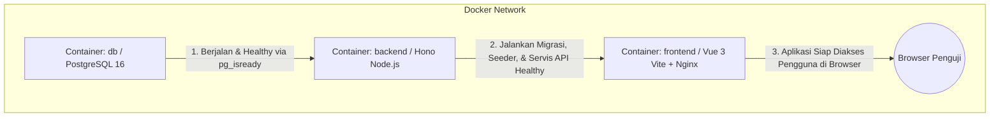

> [!NOTE]
> Dokumen ini mendefinisikan rancangan arsitektur global, susunan direktori (*directory tree*), tanggung jawab tiap layer, standar isolasi folder pengujian (*dedicated test directories*), serta alur orkestrasi Docker untuk aplikasi **Factory Maintenance Request Log**. Dokumen ini menjadi cetak biru (*blueprint*) saat tahap inisialisasi proyek dan menjadi materi rujukan untuk isi `README.md` pada repositori akhir.

---

## 1. Arsitektur Monorepo Global

Sistem dirancang menggunakan pola **Monorepo Ringan** (*single repository* dengan dua sub-folder utama: `backend` dan `frontend`) untuk memudahkan evaluasi penguji, sentralisasi konfigurasi Docker Compose, serta konsistensi CI pipeline dalam satu `Jenkinsfile`.

```text
hirose-maintenance-log/
├── AGENTS.md                     # Aturan universal agen AI (Database Safety & .env Protection)
├── GEMINI.md                     # Aturan workspace Gemini CLI / Antigravity
├── docker-compose.yml            # Orkestrasi container (DB, Backend, Frontend)
├── Jenkinsfile                   # Definisi tahapan CI (Lint, Test, Build)
├── README.md                     # Dokumentasi setup, arsitektur, akun seed, AI Disclosure
├── docs/                         # Folder dokumentasi perencanaan & referensi arsitektur
│   ├── BRD.md                    # Business Requirements Document
│   ├── User Stories.md           # Acceptance criteria & skenario pengguna
│   ├── Struktur Proyek.md        # Arsitektur modul & standar folder
│   └── Roadmap Project.md        # Rencana kerja & matriks keterlacakan fase
│
├── backend/                      # Service API Backend (Hono + TypeScript)
│   ├── .env.example              # Template variabel lingkungan backend (Port, DB, JWT)
│   ├── .gitignore                # Mengabaikan node_modules, dist, .env, dll
│   ├── Dockerfile                # Multi-stage Docker build untuk backend
│   ├── drizzle.config.ts         # Konfigurasi migrasi Drizzle Kit
│   ├── package.json              # Dependencies backend
│   ├── tsconfig.json             # Konfigurasi TypeScript backend
│   ├── vitest.config.ts          # Konfigurasi automated testing backend (Vitest)
│   ├── src/                      # Source code aplikasi backend murni (bebas dari file pengujian)
│   │   ├── config/               # Environment (env.ts) & database connection pooling
│   │   ├── db/                   # Skema database, migrasi, dan seeder
│   │   │   ├── index.ts          # Inisialisasi koneksi database (Postgres client / Drizzle)
│   │   │   ├── schema.ts         # Definisi tabel (roles, permissions, role_permissions, users, machines, requests)
│   │   │   ├── migrate.ts        # Script runner migrasi Drizzle programatik
│   │   │   ├── seed.ts           # Script pembuat data roles, permissions, akun, mesin, & requests
│   │   │   └── migrations/       # File SQL / migration files hasil generate
│   │   ├── middlewares/          # Middleware Hono
│   │   │   ├── auth.middleware.ts     # Validasi JWT / sesi & penentuan user login
│   │   │   ├── rbac.middleware.ts     # Penegakan hak akses role & kepemilikan data
│   │   │   └── logger.middleware.ts   # Structured JSON logger (Bonus #4 / US-SYS-02)
│   │   ├── modules/              # Pemisahan fitur modular (Routes, Schemas, Services)
│   │   │   ├── auth/             # Login, logout, me
│   │   │   ├── machines/         # Read-only machines list (helper dropdown)
│   │   │   ├── requests/         # CRUD maintenance requests, filter, pagination, review
│   │   │   └── users/            # User management khusus Admin & deaktivasi
│   │   ├── types/                # Definisi tipe global konteks Hono (context.ts)
│   │   ├── utils/                # Utilitas (password.ts dengan bcryptjs)
│   │   └── index.ts              # Entry point utama server Hono & endpoint /health
│   └── tests/                    # FOLDER KHUSUS PENGUJIAN OTOMATIS BACKEND (SEJAJAR DENGAN SRC)
│       ├── helpers.ts            # Utilitas testing, mock user, & auth helper
│       ├── auth.test.ts          # Pengujian endpoint auth, verifikasi JWT, & middleware RBAC
│       └── rbac.test.ts          # Pengujian otomatis lengkap 18 poin Matriks RBAC
│
└── frontend/                     # Antarmuka Pengguna (Vue 3 Vite SPA)
    ├── .env.example              # Template variabel lingkungan frontend (VITE_API_BASE_URL)
    ├── .gitignore                # Mengabaikan node_modules, dist, .env, dll
    ├── Dockerfile                # Multi-stage Docker build untuk frontend (Nginx)
    ├── nginx.conf                # Konfigurasi Nginx SPA reverse proxy & history mode
    ├── package.json              # Dependencies frontend
    ├── vite.config.ts            # Konfigurasi Vite Vue 3
    ├── vitest.config.ts          # Konfigurasi automated testing frontend (Vitest)
    ├── index.html                # Entry point HTML
    ├── src/                      # Source code aplikasi frontend murni (bebas dari file pengujian)
    │   ├── App.vue               # Root Vue component
    │   ├── assets/               # Styling global (CSS / Tailwind / Icons)
    │   ├── components/           # Komponen UI reusable (Navbar, Badges, Modals)
    │   ├── composables/          # Custom composables / fetch wrapper (useApi, useAuth)
    │   ├── router/               # Vue Router & client-side route guard (auth & role check)
    │   ├── views/                # Halaman aplikasi (LoginView, RequestsView, UsersView)
    │   └── stores/               # State management (Pinia) untuk user & token
    └── tests/                    # FOLDER KHUSUS PENGUJIAN OTOMATIS FRONTEND (SEJAJAR DENGAN SRC)
        ├── unit/                 # Pengujian unit untuk stores Pinia & composables useApi
        └── components/           # Pengujian rendering komponen berbasis peran pengguna
```

---

## 2. Tanggung Jawab Tiap Lapisan Backend (Hono)

Untuk menjaga kode tetap bersih, mudah diuji, dan transparan saat *code walkthrough* wawancara, backend menerapkan pola arsitektur berlapis (*Layered Architecture*):

1. **Routes & Schemas (`*.routes.ts` & `*.schema.ts`)**:
   - Mendefinisikan endpoint URL dan method HTTP.
   - Menggunakan `@hono/zod-openapi` untuk mendefinisikan validasi skema request body, parameter query, serta dokumentasi Swagger secara bersamaan.
2. **Middlewares (`auth.middleware.ts`, `rbac.middleware.ts`, `logger.middleware.ts`)**:
   - `auth.middleware`: Mengekstrak token dari header `Authorization: Bearer <token>`, memverifikasi tanda tangan kriptografi, memastikan pengguna masih aktif (`is_active = true`), dan menyematkan objek user ke *Context* Hono (`c.set('user', user)`).
   - `rbac.middleware`: Mencegah akses sebelum mencapai logic bila role tidak diizinkan (misal menolak Operator saat mencoba memanggil endpoint admin/supervisor dengan respons `403 Forbidden`).
   - `logger.middleware`: Structured JSON logging yang mencatat metrik latensi dan status HTTP setiap request secara real-time.
3. **Services (`*.service.ts`)**:
   - Berisi murni logika bisnis: aturan transisi status (misal: hanya boleh edit jika status masih `Submitted`), logika pembuatan seeder, perhitungan pagination, dan hash password.
4. **Data Access / Database Layer (`db/`)**:
   - Menghubungkan aplikasi ke PostgreSQL via Drizzle ORM.
   - Menjalankan migrasi tabel dan seeding data secara otomatis saat service pertama kali dihidupkan.

---

## 3. Tanggung Jawab Tiap Lapisan Frontend

1. **Route Middleware (Client Guard)**:
   - Mencegah pengguna belum login mengakses halaman dashboard (dilempar ke `/login`).
   - Mencegah pengguna selain Admin mengakses halaman menu `/users`.
2. **Components**:
   - Komponen visual modular yang menerima properti (`props`) dan mengirimkan aksi (`events`).
3. **Composables / API Client**:
   - Sentralisasi pemanggilan HTTP ke backend Hono dengan otomatis menyisipkan header Authorization (Bearer Token) dan menangani error secara terpadu.

---

## 4. Standar Isolasi Folder Pengujian (Dedicated Test Directories)

> [!IMPORTANT]
> Seluruh file pengujian otomatis (**automated tests**) pada backend maupun frontend **wajib diletakkan pada folder khusus `tests/` yang berdiri sendiri di tingkat *root* modul (sejajar dengan `src/`)**, dan **DILARANG KERAS** ditaruh di dalam folder `src/` (misal: `src/tests/` atau `src/__tests__/`).

### Justifikasi Arsitektur & Keuntungan Teknis:
1. **Pemisahan Tanggung Jawab Murni (*Strict Separation of Concerns*)**:
   Folder `src/` hanya berisi kode aplikasi yang benar-benar dieksekusi di lingkungan produksi. File mock, test fixtures, dan skenario pengujian tidak tercampur dengan logika bisnis.
2. **Optimasi Kompilasi TypeScript (`tsc`)**:
   Proses kompilasi produksi (`npm run build` yang menjalankan `tsc`) hanya menargetkan folder `src/` tanpa terganggu oleh tipe-tipe pengujian atau memproduksi file `.js` pengujian di folder output `dist/`.
3. **Efisiensi Docker Multi-Stage Build**:
   Image Docker produksi hanya menyalin kode produksi dari `src/` dan dependensi runtime, menghasilkan ukuran image yang ramping dan aman tanpa membawa berkas pengujian.
4. **Kejelasan Eksekusi CI/CD**:
   Pipeline Jenkins (`Jenkinsfile`) dapat menjalankan target pengujian dengan perintah yang jelas dan terisolasi (`vitest run tests/...`) tanpa risiko salah mengeksekusi file pengujian sebagai modul aplikasi.

---

## 5. Orkestrasi Docker Compose

Konfigurasi `docker-compose.yml` diatur agar memiliki dependensi startup yang sehat (*health dependency*):



### Ketergantungan Layanan (*Service Dependencies*):
1. **Service `db`**:
   - Menggunakan base image `postgres:16-alpine`.
   - Memiliki healthcheck perintah `pg_isready -U $POSTGRES_USER -d $POSTGRES_DB`.
2. **Service `backend`**:
   - Menunggu service `db` berada dalam kondisi `service_healthy`.
   - Menjalankan script auto-migration dan seeder secara otomatis.
   - Mengekspos port API (misal: `3000`) dan menyediakan healthcheck endpoint `GET /health`.
3. **Service `frontend`**:
   - Terhubung ke `backend` dan melayani antarmuka pengguna pada port (misal: `80` atau `5173`).

---

## 6. Pemetaan Tahapan Pipeline CI (`Jenkinsfile`)

Tahapan pipeline Jenkins dirancang terstruktur dan logis:
1. **Stage 1: Checkout**: Mengambil kode sumber dari branch Git.
2. **Stage 2: Setup & Install Dependencies**: Menjalankan instalasi paket di backend dan frontend.
3. **Stage 3: Linting & Type Checking**: Memastikan tidak ada pelanggaran aturan penulisan kode (`npm run lint` & `tsc --noEmit`).
4. **Stage 4: Automated Testing**: Menjalankan pengujian otomatis di backend dan frontend melalui folder khusus `tests/` (`npm run test` via Vitest).
5. **Stage 5: Docker Build**: Memverifikasi proses pembuatan image Docker berhasil tanpa kendala (`docker compose build`).

---

## 7. Panduan Inisialisasi Perangkat Lunak (Scaffolding Manual)

Saat melakukan inisialisasi awal di terminal proyek:

```bash
# 1. Inisialisasi Backend (Hono)
npm create hono@latest backend
# Pilih template: nodejs
# Masuk ke folder backend: cd backend && npm install

# 2. Inisialisasi Frontend (Vue 3 Vite SPA)
npm create vue@latest frontend -- --typescript --router --pinia --eslint --prettier
# Pindahkan folder pengujian default src/__tests__ ke tests/

# 3. Buat file root & template konfigurasi
# Root: docker-compose.yml, Jenkinsfile, README.md, AGENTS.md, GEMINI.md
# Sub-folders: backend/.env.example, frontend/.env.example
```
